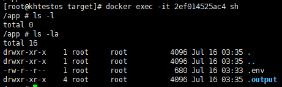

# Nuxt 项目实战 - 17：docker 打包优化，Image体积缩减89%，打包时间节约71%

---

## 背景

源于这张对比图，为啥java程序打出来的Image才一百M，而Nuxt打出来的Image却有1G多，难道前端牛逼一些？肯定不是，所以我就好奇，这个Image里面到底装了什么东西，所以我就尝试搜索，如何查看docker image 里面有什么，于是就找到以下进入容器的命令：

```bash
docker exec -it ContainerID sh
```

## 查看容器里都有些什么

- 优化前

- 优化后

    

## 总结

## 参考文献

-
